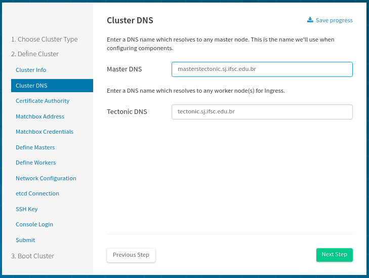
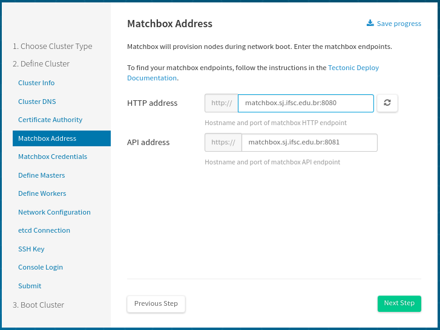
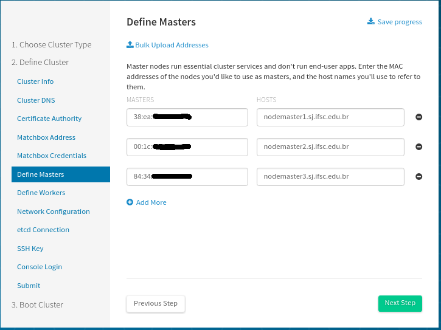
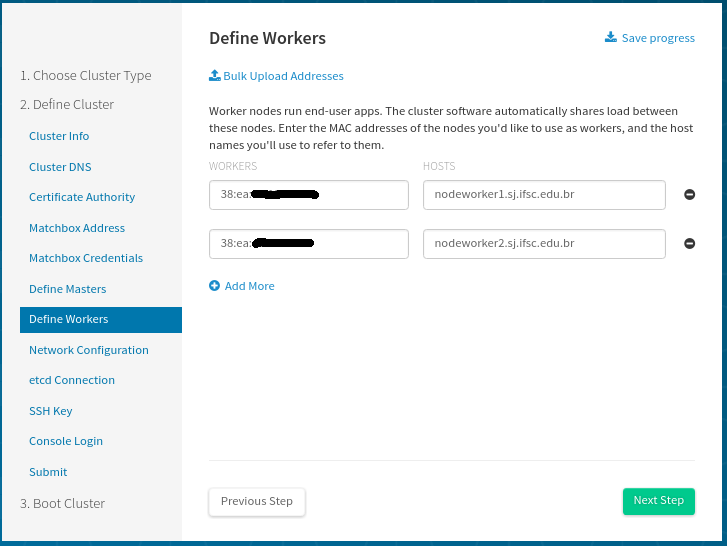

# instalacao_tectonic_bare_metal

Nesse repositório são descritas as configurações básicas da nossa instalação do [_cluster_ Tectonic](https://coreos.com/tectonic/docs/latest/install/bare-metal/) que dá suporte aos [Serviços em Kubernetes](https://github.com/ctic-sje-ifsc/kubernetes). O [Tectonic](https://coreos.com/tectonic) é uma implementação _open source_ e _enterprise-ready_ do [kubernetes](https://kubernetes.io/).

Seguindo os [requisitos](https://coreos.com/tectonic/docs/latest/install/bare-metal/requirements.html) e a [documentação oficial de instalação](https://coreos.com/tectonic/docs/latest/install/bare-metal/) podemos destacar:

## Estrutura de provisionamento(Matchbox):

Fizemos a instalação/configuração do [Matchbox no kubernetes](https://github.com/ctic-sje-ifsc/servicos_kubernetes/tree/master/srv/matchbox)

Ficando disponíveis nas seguintes URL's:

HTTP address: http://matchbox.sj.ifsc.edu.br:8080 
API address https://matchbox.sj.ifsc.edu.br:8081


## Configuração de rede/Infraestrutura PXE:

Utilizamos uma imagem do serviço [coreos/DNSMASQ](https://coreos.com/matchbox/docs/latest/network-setup.html#coreosdnsmasq) em container para rodar DHCP, TFTP, e DNS. Ou seja, toda a configuração de rede/PXE necessária.
```sh
sudo docker run --cap-add=NET_ADMIN --net=host quay.io/coreos/dnsmasq   -d -q   \
--dhcp-range=191.36.8.21,191.36.8.25 --enable-tftp --tftp-root=/var/lib/tftpboot  \
--dhcp-userclass=set:ipxe,iPXE   --dhcp-boot=tag:#ipxe,undionly.kpxe   \
--dhcp-boot=tag:ipxe,http://matchbox.sj.ifsc.edu.br:8080/boot.ipxe   \
--dhcp-host=38:ea:a7:**:**:**,nodemaster1.sj.ifsc.edu.br,191.36.8.21,infinite   \
--dhcp-host=00:1c:c0:**:**:**,nodemaster2.sj.ifsc.edu.br,191.36.8.22,infinite   \
--dhcp-host=84:34:97:**:**:**,nodemaster3.sj.ifsc.edu.br,191.36.8.23,infinite   \
--dhcp-host=38:ea:a7:**:**:**,nodeworker1.sj.ifsc.edu.br,191.36.8.24,infinite   \
--dhcp-host=38:ea:a7:**:**:**,nodeworker2.sj.ifsc.edu.br,191.36.8.25,infinite   --log-queries   --log-dhcp & > /dev/null 
```

## Entradas no DNS:

* Controller DNS
```
; 20171009 Gabriel: Tectonic 
masterstectonic IN A 191.36.8.21 
masterstectonic IN A 191.36.8.22 
masterstectonic IN A 191.36.8.23 
nodemaster1        IN A 191.36.8.21 
nodemaster2        IN A 191.36.8.22 
nodemaster3        IN A 191.36.8.23 
```
* Tectonic DNS
```sh
tectonic IN A 191.36.8.24 
tectonic IN A 191.36.8.25 
nodeworker1        IN A 191.36.8.24 
nodeworker2        IN A 191.36.8.25 
```

## Instalador Tectonic:
Segue imagens de configurações importantes 








